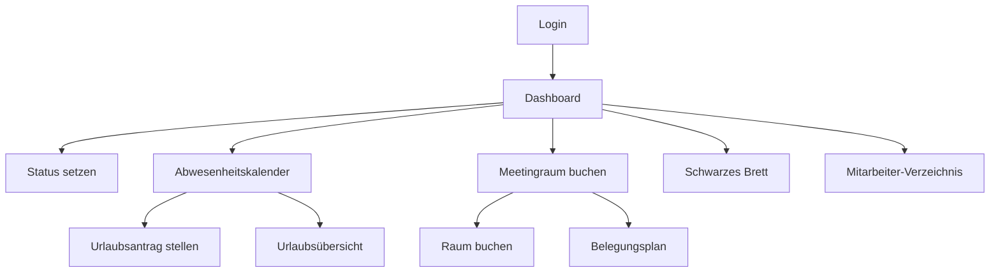

## 1. Produktübersicht
Der Büro Manager ist eine Web-App zur Verwaltung von Büroressourcen und Anwesenheitsstatus für kleine Teams bis zu 10 Personen. Die Anwendung bietet Echtzeit-Statusverfolgung und erleichtert die tägliche Büroorganisation durch intuitive Funktionen für Raumbuchung, Aufgabenverwaltung und Kommunikation.

Das Produkt löst das Problem der unübersichtlichen Büroorganisation und verbessert die Teamkommunikation durch zentrale Verwaltung von Anwesenheit, Ressourcen und gemeinsamen Aufgaben.

## 2. Kernfunktionen

### 2.1 Benutzerrollen
| Rolle | Registrierungsmethode | Kernberechtigungen |
|------|---------------------|------------------|
| Mitarbeiter | Einladung durch Admin | Status setzen, Räume buchen, Aufgaben erstellen |
| Admin | Erste Registrierung | Alle Funktionen, Benutzerverwaltung, Systemeinstellungen |

### 2.2 Funktionsmodule
Unsere Büro Manager Anforderungen bestehen aus folgenden Hauptseiten:
1. **Dashboard**: Anwesenheitsübersicht aller Mitarbeiter mit Echtzeit-Status-Anzeige
2. **Abwesenheitskalender**: Urlaubsplanung mit Jahresübersicht und Genehmigungsworkflow
3. **Meetingraum-Buchung**: Raumverfügbarkeit prüfen und Meetings buchen
4. **Schwarzes Brett**: Gemeinsame Aufgaben und Notizen für das Team
5. **Mitarbeiter-Verzeichnis**: Kontaktdaten und Abteilungszuordnung

### 2.3 Seitendetails
| Seitenname | Modulname | Funktionsbeschreibung |
|-----------|-------------|---------------------|
| Dashboard | Status-Board | Zeigt Anwesenheitsstatus aller Mitarbeiter in Echtzeit: Im Büro, Außendienst, Feierabend, Termin, Urlaub |
| Dashboard | Status-Wechsel | Mitarbeiter können eigenen Status mit einem Klick ändern mit optionaler Begründung |
| Dashboard | Aktivitäts-Stream | Zeigt letzte Status-Änderungen chronologisch an |
| Abwesenheitskalender | Urlaubsantrag | Mitarbeiter können Urlaub eintragen mit Zeitraum und Grund |
| Abwesenheitskalender | Genehmigung | Admin kann Urlaubsanträge genehmigen oder ablehnen |
| Abwesenheitskalender | Übersicht | Monats- und Jahresansicht mit allen Abwesenheiten |
| Meetingraum-Buchung | Raumauswahl | Auswahl zwischen verfügbaren Meetingräumen |
| Meetingraum-Buchung | Zeitbuchung | Buchung mit Datum, Uhrzeit und Dauer |
| Meetingraum-Buchung | Belegungsplan | Visualisiert Belegung aller Räume im Tages- und Wochenüberblick |
| Schwarzes Brett | Aufgabenliste | Gemeinsame Aufgaben wie 'Kaffee kaufen', 'Druckerpatrone wechseln' |
| Schwarzes Brett | Notizen | Kurze Mitteilungen für das Team |
| Schwarzes Brett | Erledigt-Markierung | Aufgaben können als erledigt markiert werden |
| Mitarbeiter-Verzeichnis | Kontaktliste | Namen, Email, Telefon, Abteilung aller Mitarbeiter |
| Mitarbeiter-Verzeichnis | Status-Anzeige | Aktueller Anwesenheitsstatus neben jedem Namen |
| Login/Registrierung | Authentifizierung | Sichere Anmeldung mit Email und Passwort |

## 3. Kernprozesse

### Mitarbeiter-Flow:
1. Login → Dashboard mit Statusübersicht
2. Eigenen Status setzen (Im Büro/Außendienst/Feierabend/Termin/Urlaub)
3. Optional: Meetingraum buchen oder Aufgabe auf Schwarzem Brett erstellen
4. Urlaub im Kalender eintragen

### Admin-Flow:
1. Login → Dashboard mit zusätzlichen Admin-Funktionen
2. Neue Mitarbeiter einladen
3. Urlaubsanträge genehmigen
4. Systemeinstellungen verwalten

## 4. Benutzeroberfläche

### 4.1 Design-Stil
- **Primärfarbe**: Modernes Blau (#2563EB) für Hauptaktionen
- **Sekundärfarbe**: Grau (#6B7280) für unterstützende Elemente
- **Button-Stil**: Abgerundete Ecken (8px Radius), weiche Schatten
- **Schriftart**: System-Font-Stack für optimale Lesbarkeit
- **Layout**: Karten-basiert mit klaren Abschnitten und viel Weißraum
- **Icons**: Moderne Line-Icons für bessere Skalierbarkeit

### 4.2 Seitendesign Überblick
| Seitenname | Modulname | UI-Elemente |
|-----------|-------------|-------------|
| Dashboard | Status-Board | Raster-Layout mit Mitarbeiter-Karten, farbige Status-Indikatoren, Echtzeit-Updates |
| Dashboard | Status-Wechsel | Dropdown-Menü mit 5 Status-Optionen, Bestätigungs-Button |
| Abwesenheitskalender | Kalender-Ansicht | Monatsansicht mit farbigen Urlaubs-Blöcken, Genehmigungs-Buttons |
| Meetingraum-Buchung | Buchungs-Formular | Datums- und Zeit-Auswahl, Raum-Auswahl, Dauer-Slider |
| Schwarzes Brett | Aufgaben-Liste | Checkbox-Liste mit Prioritäts-Markierung, Erstellungs-Datum |

### 4.3 Responsiveness
Desktop-first Ansatz mit mobiler Anpassung. Die Anwendung ist primär für Desktop-Nutzung im Büro optimiert, bietet aber eine angepasste mobile Ansicht für unterwegs. Touch-Interaktionen sind für Tablets optimiert.

## 5. Zusätzliche Anforderungen
- Echtzeit-Synchronisation aller Status-Änderungen
- Email-Benachrichtigungen bei wichtigen Änderungen
- Export-Funktion für Abwesenheitsübersicht
- Dark-Mode für späte Arbeitszeiten
- Schnellzugriff über Browser-Bookmark