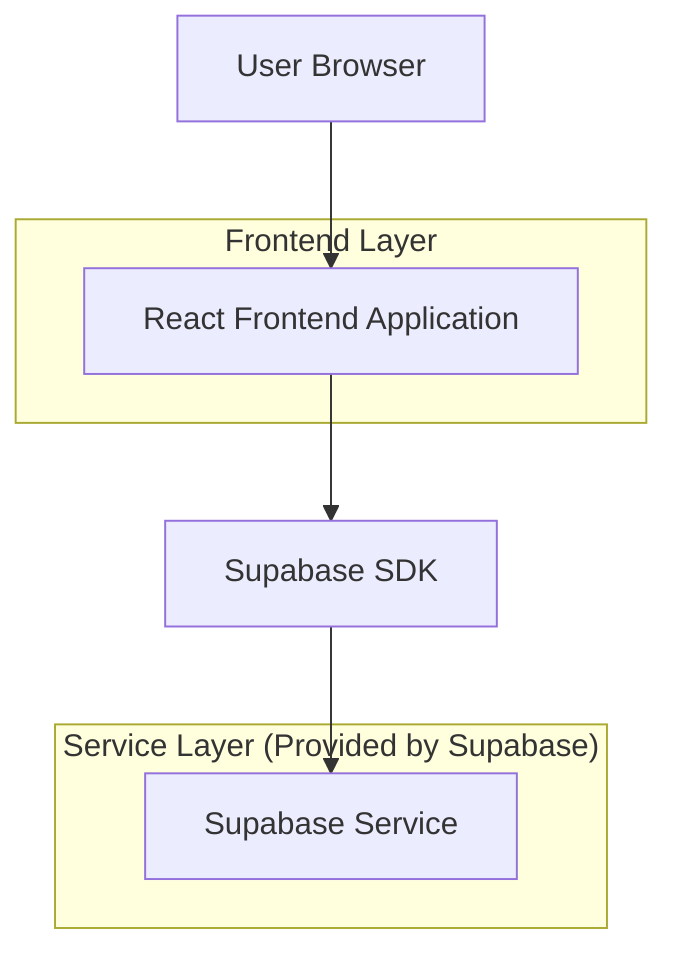
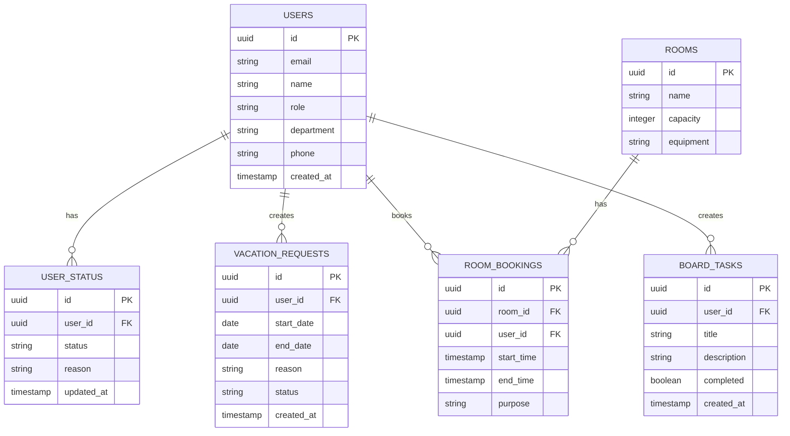

## 1. Architektur-Design



## 2. Technologie-Beschreibung
- **Frontend**: React@18 + Tailwind CSS@3 + Vite
- **Initialisierungs-Tool**: vite-init
- **Backend**: Supabase (Authentication, Realtime Database, Storage)
- **Sprache**: TypeScript für type-sichere Entwicklung

## 3. Route-Definitionen
| Route | Zweck |
|-------|---------|
| / | Dashboard mit Anwesenheitsübersicht |
| /login | Login-Seite für Benutzer-Authentifizierung |
| /register | Registrierung neuer Benutzer (nur Admin) |
| /calendar | Abwesenheitskalender mit Urlaubsplanung |
| /rooms | Meetingraum-Buchung mit Belegungsplan |
| /board | Schwarzes Brett für gemeinsame Aufgaben |
| /directory | Mitarbeiter-Verzeichnis mit Kontaktdaten |
| /profile | Benutzerprofil mit persönlichen Einstellungen |

## 4. API-Definitionen

### 4.1 Supabase-Tabellen-Operationen

**Benutzer-Authentifizierung**
```typescript
// Supabase Auth - Integriert, keine manuellen API-Endpunkte nötig
```

**Status-Updates**
```typescript
// Insert/Update user status
const { data, error } = await supabase
  .from('user_status')
  .upsert({ 
    user_id: userId,
    status: 'office' | 'external' | 'finished' | 'appointment' | 'vacation',
    reason: string,
    updated_at: new Date()
  })
```

**Urlaubsanträge**
```typescript
// Create vacation request
const { data, error } = await supabase
  .from('vacation_requests')
  .insert({
    user_id: userId,
    start_date: Date,
    end_date: Date,
    reason: string,
    status: 'pending'
  })

// Approve/Reject vacation
const { data, error } = await supabase
  .from('vacation_requests')
  .update({ status: 'approved' | 'rejected' })
  .eq('id', requestId)
```

**Meetingraum-Buchung**
```typescript
// Check room availability
const { data, error } = await supabase
  .from('room_bookings')
  .select('*')
  .eq('room_id', roomId)
  .overlaps('start_time', end_time, startTime, endTime)

// Create booking
const { data, error } = await supabase
  .from('room_bookings')
  .insert({
    room_id: roomId,
    user_id: userId,
    start_time: Date,
    end_time: Date,
    purpose: string
  })
```

## 5. Server-Architektur
Da Supabase als Backend-as-a-Service verwendet wird, ist keine separate Server-Architektur erforderlich. Alle Geschäftslogik wird über Supabase-Funktionen und clientseitige TypeScript-Code implementiert.

## 6. Datenmodell

### 6.1 Datenmodell-Definition


### 6.2 Daten-Definition-Sprache (DDL)

**Benutzer-Tabelle (users)**
```sql
-- Tabelle erstellen
CREATE TABLE users (
  id UUID PRIMARY KEY DEFAULT gen_random_uuid(),
  email VARCHAR(255) UNIQUE NOT NULL,
  name VARCHAR(100) NOT NULL,
  role VARCHAR(20) DEFAULT 'employee' CHECK (role IN ('employee', 'admin')),
  department VARCHAR(50),
  phone VARCHAR(20),
  created_at TIMESTAMP WITH TIME ZONE DEFAULT NOW()
);

-- Indizes erstellen
CREATE INDEX idx_users_email ON users(email);
CREATE INDEX idx_users_role ON users(role);
```

**Benutzer-Status Tabelle (user_status)**
```sql
-- Tabelle erstellen
CREATE TABLE user_status (
  id UUID PRIMARY KEY DEFAULT gen_random_uuid(),
  user_id UUID REFERENCES users(id) ON DELETE CASCADE,
  status VARCHAR(20) NOT NULL CHECK (status IN ('office', 'external', 'finished', 'appointment', 'vacation')),
  reason TEXT,
  updated_at TIMESTAMP WITH TIME ZONE DEFAULT NOW()
);

-- Indizes erstellen
CREATE INDEX idx_user_status_user_id ON user_status(user_id);
CREATE INDEX idx_user_status_updated_at ON user_status(updated_at DESC);
```

**Urlaubsanträge Tabelle (vacation_requests)**
```sql
-- Tabelle erstellen
CREATE TABLE vacation_requests (
  id UUID PRIMARY KEY DEFAULT gen_random_uuid(),
  user_id UUID REFERENCES users(id) ON DELETE CASCADE,
  start_date DATE NOT NULL,
  end_date DATE NOT NULL,
  reason TEXT,
  status VARCHAR(20) DEFAULT 'pending' CHECK (status IN ('pending', 'approved', 'rejected')),
  created_at TIMESTAMP WITH TIME ZONE DEFAULT NOW()
);

-- Indizes erstellen
CREATE INDEX idx_vacation_user_id ON vacation_requests(user_id);
CREATE INDEX idx_vacation_status ON vacation_requests(status);
```

**Meetingräume Tabelle (rooms)**
```sql
-- Tabelle erstellen
CREATE TABLE rooms (
  id UUID PRIMARY KEY DEFAULT gen_random_uuid(),
  name VARCHAR(100) NOT NULL,
  capacity INTEGER NOT NULL,
  equipment TEXT
);

-- Beispiel-Daten
INSERT INTO rooms (name, capacity, equipment) VALUES 
  ('Konferenzraum 1', 8, 'Beamer, Whiteboard'),
  ('Konferenzraum 2', 4, 'Beamer'),
  ('Besprechungsraum', 6, 'Whiteboard');
```

**Raum-Buchungen Tabelle (room_bookings)**
```sql
-- Tabelle erstellen
CREATE TABLE room_bookings (
  id UUID PRIMARY KEY DEFAULT gen_random_uuid(),
  room_id UUID REFERENCES rooms(id) ON DELETE CASCADE,
  user_id UUID REFERENCES users(id) ON DELETE CASCADE,
  start_time TIMESTAMP WITH TIME ZONE NOT NULL,
  end_time TIMESTAMP WITH TIME ZONE NOT NULL,
  purpose TEXT,
  created_at TIMESTAMP WITH TIME ZONE DEFAULT NOW()
);

-- Indizes erstellen
CREATE INDEX idx_booking_room_time ON room_bookings(room_id, start_time, end_time);
```

**Schwarzes Brett Aufgaben Tabelle (board_tasks)**
```sql
-- Tabelle erstellen
CREATE TABLE board_tasks (
  id UUID PRIMARY KEY DEFAULT gen_random_uuid(),
  user_id UUID REFERENCES users(id) ON DELETE CASCADE,
  title VARCHAR(200) NOT NULL,
  description TEXT,
  completed BOOLEAN DEFAULT FALSE,
  created_at TIMESTAMP WITH TIME ZONE DEFAULT NOW()
);

-- Indizes erstellen
CREATE INDEX idx_tasks_user_id ON board_tasks(user_id);
CREATE INDEX idx_tasks_completed ON board_tasks(completed);
```

### 6.3 Supabase-Richtlinien
```sql
-- Lesezugriff für anonyme Benutzer (public role)
GRANT SELECT ON users TO anon;
GRANT SELECT ON user_status TO anon;
GRANT SELECT ON rooms TO anon;
GRANT SELECT ON room_bookings TO anon;
GRANT SELECT ON board_tasks TO anon;

-- Vollzugriff für authentifizierte Benutzer
GRANT ALL PRIVILEGES ON users TO authenticated;
GRANT ALL PRIVILEGES ON user_status TO authenticated;
GRANT ALL PRIVILEGES ON vacation_requests TO authenticated;
GRANT ALL PRIVILEGES ON room_bookings TO authenticated;
GRANT ALL PRIVILEGES ON board_tasks TO authenticated;

-- Row Level Security (RLS) Richtlinien
ALTER TABLE user_status ENABLE ROW LEVEL SECURITY;
ALTER TABLE vacation_requests ENABLE ROW LEVEL SECURITY;
ALTER TABLE room_bookings ENABLE ROW LEVEL SECURITY;
ALTER TABLE board_tasks ENABLE ROW LEVEL SECURITY;
```

## 7. Echtzeit-Funktionalität
Supabase Realtime wird für folgende Features aktiviert:
- Live-Status-Updates aller Mitarbeiter
- Sofortige Aktualisierung bei Raum-Buchungen
- Echtzeit-Updates beim Schwarzen Brett

```typescript
// Realtime-Abonnement für Status-Updates
const subscription = supabase
  .from('user_status')
  .on('INSERT', payload => {
    console.log('Status change received!', payload)
  })
  .subscribe()
```